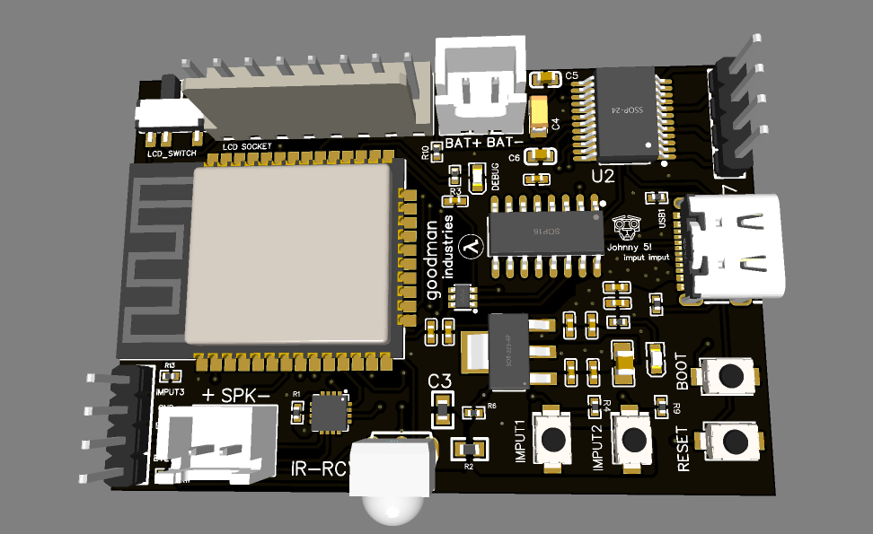

# Emiglio modchip


Scheda embedded per riportare in vita l'Emiglio, il robot giocattolo degli anni '90.
ESP32-WROOM-32E, driver motori TB6612FNG, amplificatore I2S MAX98357A, display TFT
ST7735S e ricevitore IR: tutto su un singolo PCB.

📐 **Progetto hardware (schematico + PCB) su OSHWLab:**
<https://oshwlab.com/alessandro2001/project_qgcpzeag>

Questo repo contiene il firmware; schematico, layout e file di produzione vivono
sul progetto OSHWLab, da cui si può aprire tutto direttamente in EasyEDA o
ordinare il PCB.

---

## Sponsor: PCBWay

<p align="center">
  <a href="https://www.pcbway.com/project/shareproject/emiglio_modchip_assembly_b18694d1.html">
    
  </a>
</p>

<p align="center">
  <b>
    🛒 Ordina la scheda già pronta →
    <a href="https://www.pcbway.com/project/shareproject/emiglio_modchip_assembly_b18694d1.html">
      emiglio modchip + assembly su PCBWay
    </a>
  </b>
</p>

Il progetto condiviso contiene i file di produzione già impostati: basta
**Add to cart** e il PCB arriva con le specifiche giuste, senza dover configurare
niente a mano.

| Specifica | Valore |
|---|---|
| Strati | 2 |
| Dimensioni | 38.2 × 56.9 mm |
| Materiale | FR-4, spessore 1.6 mm |
| Finitura | HASL (con stagno-piombo) |
| Solder mask | nera |
| Serigrafia | bianca |

**Proud to announce a new sponsorship by PCBWay!**

I PCB di questo progetto sono prodotti da [**PCBWay**](https://www.pcbway.com/):
prototipi di alta qualità, assemblaggio SMT, stencil e servizio di verifica DFM
gratuito prima della messa in produzione. Per una scheda qualsiasi si parte da
**<https://www.pcbway.com/>**; per *questa* scheda c'è il link diretto qui sopra.

Lo sponsor ha anche un posto d'onore nel firmware: lo sketch
[`pcbway/pcbway.ino`](pcbway/pcbway.ino) mostra il logo animato sul display TFT
della scheda.

---

## Schematico


File: [`Schematic_emiglio-modchip_2026-07-28.png`](Schematic_emiglio-modchip_2026-07-28.png)
— rev. 1.0, disegnato in EasyEDA. Sorgente editabile e netlist:
[progetto su OSHWLab](https://oshwlab.com/alessandro2001/project_qgcpzeag).

Blocchi presenti sulla scheda:

| Blocco | Componenti principali | Note |
|---|---|---|
| **POWER** | AMS1117-3.3 (U5) | 5 V → 3V3, LED di presenza tensione |
| **USB C TTL** | USB Type-C 3.1 16P + CH340C (U4) + UMH3N (Q2) | programmazione e seriale, auto-reset EN/IO0 |
| **MCU** | ESP32-WROOM-32E 16 MB (U6) | pulsanti BOOT / RESET, LED debug, connettore occhi e IMPUT3 |
| **Motor driver** | TB6612FNG (U2) | 2 canali (A/B), VM da batteria, STBY con pull-down 10k |
| **I2S Audio Amp** | MAX98357A (U1) | uscita speaker su HC-XH-2A-G, VDD 5 V, GAIN via R1 1M |
| **LCD display** | connettore CN1 KF2510-8A + LCD_SWITCH | pannello ST7735S 128×160, alimentato da 3V3 commutato |
| **IR Receiver** | TSOP4838 | ricezione telecomando su GPIO35 |

### Pinout usato dal firmware

| Funzione | GPIO |
|---|---|
| TFT SCLK / MOSI | 18 / 23 |
| TFT RES / DC / CS | 2 / 4 / 15 |
| I2S BCLK / LRC (WS) / DIN | 26 / 25 / 22 |
| Motori PWMA / AIN1 / AIN2 | 13 / 27 / 14 |
| Motori PWMB / BIN1 / BIN2 | 21 / 32 / 33 |
| TB6612 STBY | 19 |
| Ricevitore IR | 35 |

> Attenzione: GPIO2 è il DC dell'LCD, quindi la libreria IRremote va inizializzata
> con `DISABLE_LED_FEEDBACK` (il feedback LED userebbe proprio GPIO2).

---

## Layout PCB


Scheda a 2 strati (rosso = top, blu = bottom). Si riconoscono la posizione del
modulo ESP32 con la keep-out dell'antenna verso il bordo, il connettore `LCD SOCKET`
con l'interruttore `LCD_SWITCH`, i morsetti `BAT+ / BAT-` e `+ SPK -`, il
ricevitore `IR-RCV` sul bordo inferiore, i pulsanti `RESET` / `BOOT` /
`IMPUT1` / `IMPUT2` e il pettine `U8` con `IMPUT3`, `GND` ed `EYE1` / `EYE2` per
gli occhi del robot. Sul silkscreen ci sono anche il logo *goodman industries* e un
saluto a Johnny 5.

### Render 3D



Vista dal lato componenti, prima della produzione. Da qui si legge la disposizione
reale meglio che dal layout: il modulo ESP32 in alto a sinistra con l'antenna a
serpentina che sporge oltre il bordo del rame, il TB6612FNG (`U2`, SSOP-24) in alto a
destra vicino ai morsetti `BAT+ / BAT-`, il CH340C (SOP-16) al centro accanto alla
USB-C, il regolatore AMS1117 in SOT-223 e il MAX98357A nel QFN quadrato in basso a
sinistra, a fianco del connettore `+ SPK -`. Sul bordo inferiore spicca la cupola
bianca del ricevitore IR, e a destra i due pulsanti `RESET` e `BOOT`.

Confronto utile: il render mostra la scheda come dovrebbe venire, l'immagine di
apertura ([`sponsor.jpg`](sponsor.jpg)) mostra come è venuta davvero — stessa
disposizione, stessi ingombri, con in più il retro serigrafato
*Emiglio modchip v1.0*.

---

## Sketch presenti nel repo

Ogni cartella è uno sketch Arduino autonomo (`.ino` con lo stesso nome della
cartella), pensato per provare un sottosistema alla volta.

### [`pcbway/`](pcbway/pcbway.ino) — schermata sponsor PCBWay
Demo grafica sul TFT ST7735S: logo PCBWay renderizzato come due bitmap 1bpp
sovrapposte (wordmark verde + swoosh arancione, 148×42, 798 byte ciascuna, così si
usano i colori reali del marchio senza spendere 12 kB di bitmap RGB565).
Include intro animata — teaser a puntini, caduta del wordmark con rimbalzo
smorzato, swoosh "routato" colonna per colonna come una pista su PCB, flash del
titolo — poi scintille casuali sui pixel vuoti del logo e marquee scorrevole a
~35 fps disegnato su `GFXcanvas1` per evitare lo sfarfallio.
**Librerie:** Adafruit_GFX, Adafruit_ST7735, SPI.

### [`LcdModchip/`](LcdModchip/LcdModchip.ino) — bring-up e taratura del display
Rev 1.2. Inizializza il pannello ST7735S su CN1 e risolve il classico problema
degli offset: azzera l'intera GRAM 132×162 (bordi non visibili compresi) subito
dopo `initR()`, poi applica `COLSTART=2 / ROWSTART=1` tramite una sottoclasse che
espone il metodo protetto `setColRowStart()`. Mostra barre colore per verificare
l'ordine RGB e uno splash con i parametri correnti; con `LCD_BORDER_TEST 1`
disegna invece la cornice di taratura con i quattro pixel d'angolo colorati.
Heartbeat non bloccante nel `loop()`.
**Librerie:** Adafruit_GFX, Adafruit_ST7735, SPI.

### [`test_motori_minimo/`](test_motori_minimo/test_motori_minimo.ino) — firmware motori
Guida il TB6612FNG con telecomando IR (indirizzo `0x07`: SU/GIU/DX/SX; ripremere
lo stesso tasto della manovra in corso fa HALT) o da seriale (`w s d a`, `x` stop,
`i` stato, `+`/`-` duty, `?` aiuto). Tutte le scritture PWM passano da un'unica
funzione `pwmWrite()` che applica il clamp `DUTY_MAX` — è l'unica difesa contro la
sovralimentazione dei motori da 6 V con VM a 12 V, non esiste un limitatore
hardware. PWM a 20 kHz (fuori dalla banda udibile), rampa di spunto a 8 step per
smorzare il picco di corrente, `STBY` tenuto basso fino a fine inizializzazione,
autospegnimento opzionale (`MAX_RUN_MS`) e decodifica del reset reason con
diagnostica dedicata al brownout.
**Librerie:** IRremote.

### [`telecom1/`](telecom1/telecom1.ino) — IR → note musicali
Suona quattro note (DO/RE/MI/FA) sui tasti direzionali del telecomando. Genera i
campioni a runtime con `sin()` su I2S a 44.1 kHz e applica un fade di 10 ms in
ingresso e uscita per evitare il pop; dopo ogni nota riempie gli 8 buffer DMA di
silenzio e ferma il clock I2S, così il silenzio è davvero silenzio. Filtri anti
falso-trigger: scarta protocollo `UNKNOWN`, i repeat, gli indirizzi di altri
telecomandi e i comandi troppo ravvicinati.
**Librerie:** IRremote, driver I2S legacy dell'ESP-IDF (`driver/i2s.h`).

### [`emiglio_speaker_max98357a/`](emiglio_speaker_max98357a/emiglio_speaker_max98357a.ino) — speaker Bluetooth A2DP
Trasforma Emiglio in una cassa Bluetooth: sink A2DP con nome `Emiglio_Speaker`,
riconnessione automatica e volume gestibile via AVRCP dal telefono. L'I2S viene
inizializzato esplicitamente con i pin della scheda e l'oggetto `I2SClass` passato
al costruttore del sink, invece di lasciare che la libreria si configuri con pin di
default che cambiano tra le versioni. WiFi spento, task audio inchiodato al core 1,
`set_max_write_delay_ms(2)` e watchdog riconfigurato a 10 s senza panic. Log di
stato ogni 10 s (connessione, stato audio, volume, heap). In coda al file c'è una
guida ai guasti tipici (pin SD flottante, GAIN, alimentazione a 5 V, BCLK/LRC
invertiti, impedenza dello speaker) e uno snippet per suonare beep locali mettendo
in pausa l'output del sink.
**Librerie:** ESP32-A2DP, ESP_I2S, WiFi, esp_bt, esp_task_wdt.

---

## Dipendenze

Tutte installabili dal Library Manager dell'IDE Arduino o via `lib_deps` in
PlatformIO.

| Libreria | Autore | Repository | Usata da |
|---|---|---|---|
| Arduino core per ESP32 | Espressif | <https://github.com/espressif/arduino-esp32> | tutti gli sketch |
| Adafruit GFX Library | Adafruit | <https://github.com/adafruit/Adafruit-GFX-Library> | `pcbway`, `LcdModchip` |
| Adafruit ST7735 / ST7789 Library | Adafruit | <https://github.com/adafruit/Adafruit-ST7735-Library> | `pcbway`, `LcdModchip` |
| Adafruit BusIO | Adafruit | <https://github.com/adafruit/Adafruit_BusIO> | dipendenza di GFX/ST7735 |
| IRremote | Armin Joachimsmeyer (z3t0) | <https://github.com/Arduino-IRremote/Arduino-IRremote> | `test_motori_minimo`, `telecom1` |
| ESP32-A2DP | Phil Schatzmann | <https://github.com/pschatzmann/ESP32-A2DP> | `emiglio_speaker_max98357a` |
| arduino-audio-tools | Phil Schatzmann | <https://github.com/pschatzmann/arduino-audio-tools> | stack audio, agganciata da ESP32-A2DP |
| ESP8266Audio | Earle F. Philhower III | <https://github.com/earlephilhower/ESP8266Audio> | stack audio, integrata da arduino-audio-tools |

`SPI`, `WiFi`, `ESP_I2S`, `driver/i2s.h`, `esp_bt.h` e `esp_task_wdt.h` arrivano
già con il core ESP32, non serve installare nulla.

### Come si incastrano le librerie audio

Nessuno sketch fa `#include <AudioTools.h>` o `#include <AudioOutput.h>`
direttamente, ma le due librerie fanno comunque parte della toolchain audio e vanno
installate — ESP32-A2DP le rileva da sola:

```cpp
// ESP32-A2DP/src/config.h
#if __has_include("AudioTools.h")
#  define A2DP_I2S_AUDIOTOOLS 1
```

Se **arduino-audio-tools** è presente nelle librerie, questa `__has_include` scatta
e `BluetoothA2DPOutput.h` include `AudioTools.h`, abilitando il percorso
`audio_tools::AudioOutput` del sink (`set_output()`, il costruttore che prende un
`AudioOutput&`). Di conseguenza **installare o rimuovere la libreria cambia come
viene compilato lo sketch A2DP, anche senza toccare una riga di codice**: è la
classica sorpresa quando la stessa sketch compila su una macchina e non sull'altra.

**ESP8266Audio** è il ponte verso i generatori e le classi `AudioOutput` storiche,
integrata da audio-tools in `AudioTools/AudioLibs/AudioESP8266.h`. Nata per
l'ESP8266, funziona anche su ESP32 e serve quando si vuole riprodurre MP3/WAV/RTTTL
invece del solo streaming A2DP — la strada naturale per dare una voce a Emiglio
oltre ai toni generati con `sin()` in `telecom1`.

Versioni verificate su questo progetto: ESP32-A2DP 1.8.11, arduino-audio-tools
1.2.5, ESP8266Audio 2.4.1, IRremote 4.7.1.

### PlatformIO

```ini
[env:esp32dev]
platform = espressif32
board = esp32dev
framework = arduino
monitor_speed = 115200
board_build.f_cpu = 240000000L
lib_deps =
    z3t0/IRremote@^4.7.1
    adafruit/Adafruit GFX Library
    adafruit/Adafruit ST7735 and ST7789 Library
    pschatzmann/ESP32-A2DP
    https://github.com/pschatzmann/arduino-audio-tools
    earlephilhower/ESP8266Audio
```

arduino-audio-tools va referenziata via URL git: non è pubblicata nel registry di
PlatformIO.

## Compilazione con l'IDE Arduino

- **Board:** ESP32 Dev Module (ESP32-WROOM-32E)
- **Flash Size:** 16 MB (128 Mb)
- **CPU Frequency:** 240 MHz (WiFi/BT) — obbligatorio per lo sketch A2DP
- **Partition Scheme:** per `emiglio_speaker_max98357a` serve uno schema con spazio
  per lo stack Bluetooth (es. *Huge APP*)
- **Upload Speed:** 921600, seriale via CH340C sulla USB-C della scheda
- **Monitor:** 115200 baud
